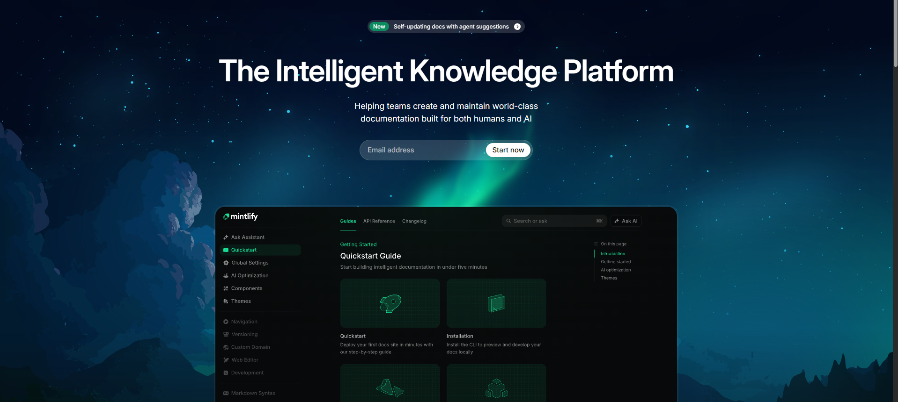
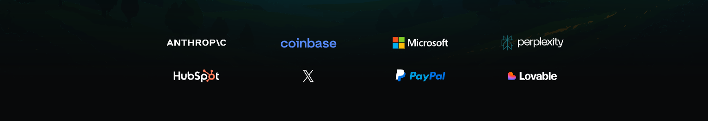
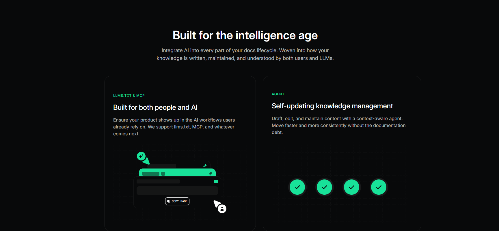

🚀 Mintlify UI Clone (HTML + CSS)
This project is recreation of Mintlify website interface (Dark mode) using only HTML and CSS.

🎯 Sections Recreated
------------------------------------------------------------------
1. Header
The header is built using Flexbox with justify-content: space-between.

  

  It contains:
    1. logo on the left, 
    2. menu on the center 
    3. "contact" sales and "start for free" buttons on the right

  It also inclludes transition for smaller screens. 

------------------------------------------------------------------
2. Main
Main is flexbox containg the contents stacked one after the other in a column. It includes

1. Hero section
  This section contains text, form inviting user's email input and preview of mintlify.
2. Trusted by section
  This section contains the logos of clients(anthropic, coinbase) queued in a grid.
3. Usecases section
    This section contains 3 cards each containing a caption, text and preview image.
4. Impact section
    This section starts with a heading and a cts button followed by 2 cards explaing features and ends with image(showing impact) and brands using mintlify's products.

------------------------------------------------------------------4. 🎨 Fonts and Colors Used
  🔤 Font
    Primary UI Font: Inter (with system sans-serif fallback)
  🎨 Color System
    --color-background-main: lab(2.42579% -.165291 -.470081);
  --color-background-invert: lab(100% 0 0);
  --color-text-main: lab(100% 0 0);
  --color-text-invert: lab(2.42579% -.165291 -.470081);
  --color-text-soft: lab(100% 0 0 / .7);
  --color-text-sub: lab(100% 0 0 / .6);
  --color-border-sub: lab(100% 0 0 / .07);
  --color-background-soft: lab(100% 0 0 / .05);
  --color-border-surface: lab(100% 0 0 / .05);
  --color-muted: lab(100% 0 0 / .5);
  --color-border-soft: lab(100% 0 0 / .15);
  --color-brand: lab(79.9844% -59.6292 22.5096);
  --color-brand-light: lab(51.3415% -41.5657 15.3527);
  --color-border-solid: lab(100% 0 0);
  --color-muted-invert: lab(2.42579% -.165291 -.470081 / .5);

------------------------------------------------------------------
